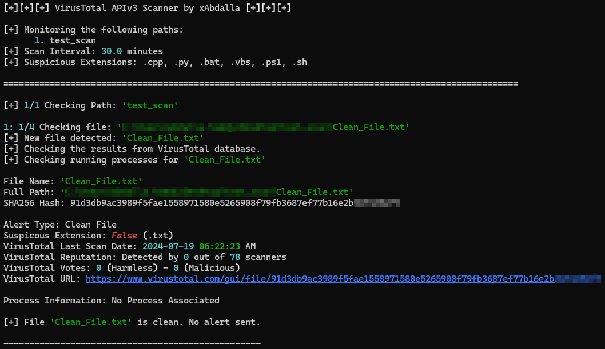
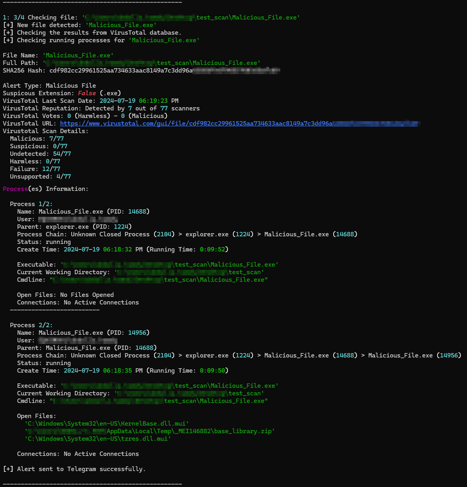
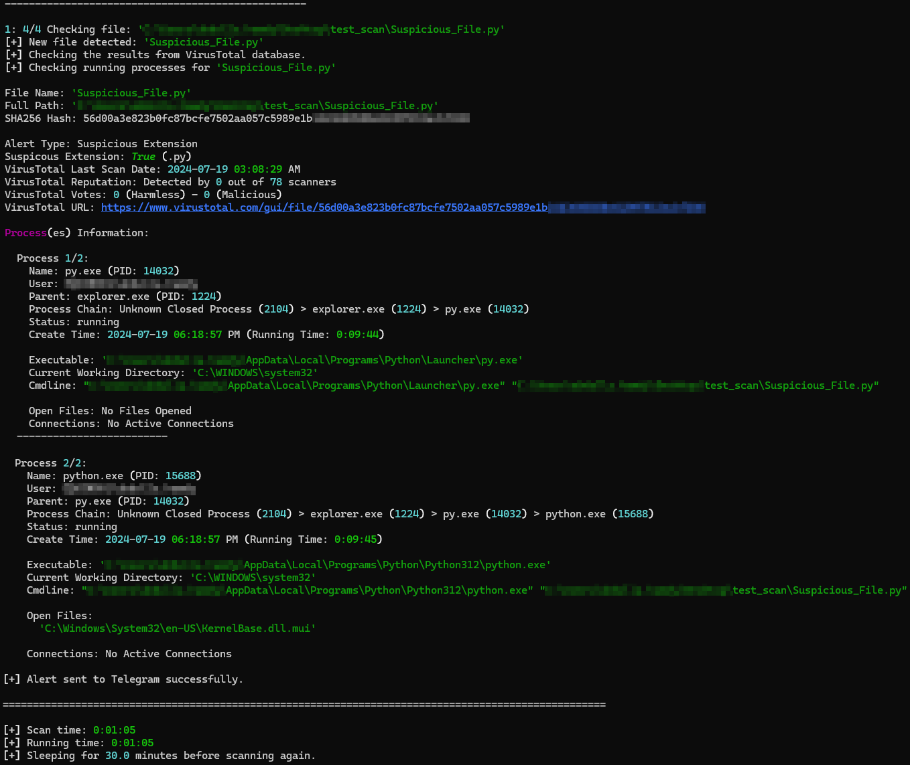
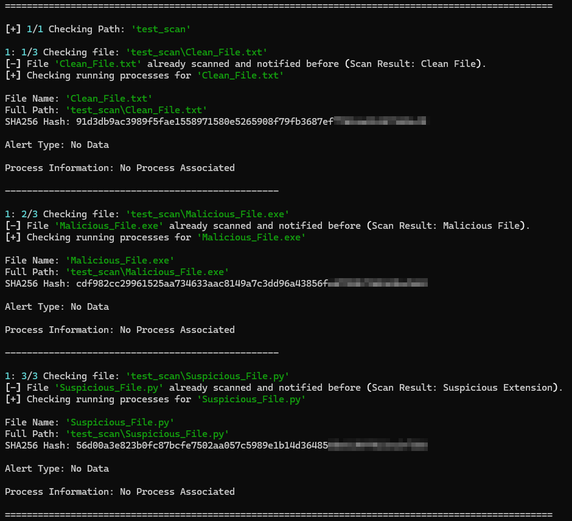
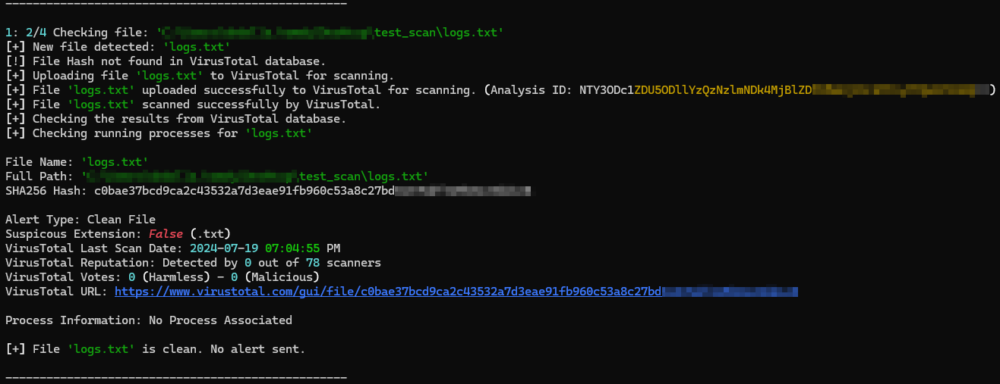
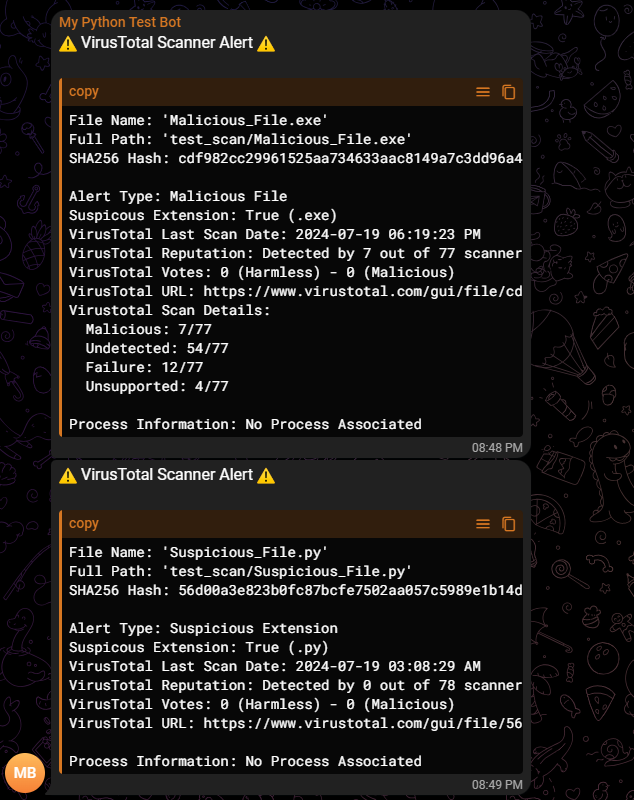

# VirusTotal Scanner


[](https://github.com/xAbdalla/VirusTotal_Scanner?tab=MIT-1-ov-file#readme)
[](https://github.com/xAbdalla)

VirusTotal Scanner is a Python script that utilizes the [VirusTotal](https://www.virustotal.com/) API v3 to scan files for potential malware or suspicious behavior. It provides a brief summary of the scan results and also retrieves information about the running processes associated with the file. If the file is identified as malicious or suspicious, the script will send a notification message through a Telegram bot. This tool is designed to enhance the security and analysis of files by leveraging the capabilities of VirusTotal's extensive malware database and process monitoring features.

## Features
- Accept both folder and file paths.
- Accept relative or absolute paths or environment variables like `%USERNAME%` and `%TEMP%`.
- Scan the folder recursively and get all the files.
- Do not request another scan for already scanned and notified files.
- Can run forever and scan only new or modified files.
- Save logs of the scans in text and JSON files.
- Save the history cache in encrypted text to prevent any user modification.
- Quota-friendly, sending requests for the newly discovered files only.
- Can upload files (<200MB) if they are not in the VirusTotal database.
- Request to rescan/re-analyze the file if the last scan is too old (>=15 days).
- If the file is associated with any process as an executable or argument or opened in the device, it will include its information in the report and get its network connections.
- **For Windows Only** (Not Required): If the script has admin privileges, it could access the event logs and get process creation logs, which will help get some useful information in the scan report.
- Send a notification of the malicious/suspicious files to the Telegram chat.
- If for any reason the notification fails, it will scan and try to send it again in the next cycle.
- If the scan report is too long for one Telegram message, it will break it into several messages and send them. (You can specify the maximum number of messages per file.)
- You can make it go to sleep between cycles.
- You can modify the variables in the code and run it directly or pass them as arguments in the terminal.
- If there are any reports on [Valhalla](https://valhalla.nextron-systems.com/) or [MalShare](https://malshare.com/), it will provide you with the URL to the report page.


## Requirements
- Clone the repo:
  ```
  git clone https://github.com/xAbdalla/VirusTotal_Scanner.git
  cd VirusTotal_Scanner
  ```
- Create a new environment:
  ```
  python -m venv vt_env
  ```
- Activate the environment:
  - For Windows:
    ```
    vt_env\Scripts\activate
    ```
  - For macOS/Linux:
    ```
    source vt_env/bin/activate
    ```
- Install the required packages:
  ```
  pip install -r requirements.txt
  ```
  **Note:** If you decide not to create a new environment, make sure to uninstall these packages:
  ```
  pip uninstall crypto 
  pip uninstall pycrypto 
  ```

## Usage
- Sign up at [VirusTotal](https://www.virustotal.com) and get your API token.
- Create a Telegram Bot and get your Bot Token. You can do it from @BotFather by following these [instructions](https://core.telegram.org/bots/tutorial#obtain-your-bot-token) from Telegram.
- Create a new Telegram Group and add your Bot to it.
- Get the Telegram Group Chat ID:
  - Open Telegram Web in your browser.
  - Open the group chat.
  - You will see the URL of the chat, something like `https://web.telegram.org/k/#-0123456789`.
  - The pattern of the link is: `https://web.telegram.org/k/#{group_chat_id}`.
  - For example, `-0123456789` is the `group_chat_id`. Don't forget the `-` sign as it is part of the ID.
  - Now, let's try to send a message: `https://api.telegram.org/bot<BOT_TOKEN>/sendMessage?chat_id=<GROUP_CHAT_ID>&text=Bot_Says_Hello`.
  - When we set the bot token and chat ID correctly, the message `Bot_Says_Hello` should arrive in our group chat.
- These are sensitive data; do not share them with anyone. It's better to use environment variables to store them. These articles from PhoenixNAP may help you:
  - [Windows](https://phoenixnap.com/kb/windows-set-environment-variable)
  - [Linux](https://phoenixnap.com/kb/linux-set-environment-variable)
  - [macOS](https://phoenixnap.com/kb/set-environment-variable-mac)
  
  If you decide to save them as environment variables, please save them as follows:
  ```
  VT_API_KEY
  TELEGRAM_BOT_TOKEN
  TELEGRAM_CHAT_ID
  ```
- `SCAN_INTERVAL` is the time that the script will sleep between cycles (in minutes).
- `FOREVER`/CYCLES is the number of times that the script will walk through paths to scan any new/modified files and the file processes. (`0` means that the script will not stop scanning for changes.)
- If you set `SCAN_INTERVAL` to `0` and `FOREVER`/CYCLES to `0`, the script will never stop or sleep, continuously scanning for changes in the paths. However, it will skip checking the processes associated with the scanned and notified files. **(Default)**
- Any files with `SUSPICIOUS_EXTENSIONS` will be notified in the Telegram chat even if the VirusTotal report says they are clean files.
- Some files are associated with many processes, generating large report texts for the Telegram message, which is limited to 4096 characters. The script will break the report into multiple messages. `MAX_MSG` is the maximum number of messages per file report that will be sent. **(Default is `1` message.)**

### Running the script
You have three options:

#### 1. Run the script without any modifications
```
python ./VTv3_Scanner.py
[+] Enter your VirusTotal API key:
[+] Enter your Telegram bot token (Enter "No" to not send telegram messages):
[+] Enter your Telegram chat ID:
```
It will ask you to input only the required values to work and use the default for the rest:
```python
PATHS = [r"test_scan", r'C:/Users/%USERNAME%/AppData/Roaming/Microsoft/Windows/Start Menu/Programs/Startup']

UPLOAD = True
SCAN_INTERVAL = 0
FOREVER = 0
MAX_MSG = 1

SUSPICIOUS_EXTENSIONS = [".exe", ".dll", ".bat", ".cmd", ".vbs", ".js", ".jse", ".wsf", ".hta", ".scr", ".pif", ".msi", ".com", ".reg", ".docm", ".xlsm", ".pptm", ".jar", ".php", ".py", ".sh", ".ps1"]

MALSHARE_API_KEY = %MALSHARE_API_KEY%
SKIP_PROCESS = False
HISTORY_LOG = True
LOGGING = True
DEBUG = False
```

#### 2. Write the required values in the script file
Open the script file with any text editor and edit these variables at the beginning of the script.

- Required Values:
  ```python
  VT_API_KEY = "PUT_YOUR_KEY_HERE"

  TELEGRAM_BOT_TOKEN = "PUT_YOUR_TOKEN_HERE"
  TELEGRAM_CHAT_ID = "PUT_YOUR_ID_HERE"
  NO_SEND = <True|False>

  PATHS = ["path/to/scan_1", "path/to/scan_2", ...]
  ```
  **Note**: If you used environment variables to store `VT_API_KEY`, `TELEGRAM_BOT_TOKEN`, and `TELEGRAM_CHAT_ID` as mentioned above, you don't have to edit them in the script file.

- Optional Values:
  ```python
  UPLOAD = <True|False>
  SCAN_INTERVAL = <Float>
  FOREVER = <INT>
  MAX_MSG = <INT>
  SUSPICIOUS_EXTENSIONS = ['.exe', '.py', '.sh', ...]
  MALSHARE_API_KEY = "PUT_YOUR_KEY_HERE"
  SKIP_PROCESS = <True|False>
  HISTORY_LOG = <True|False>
  LOGGING = <True|False>
  DEBUG = <True|False>
  ```

#### 3. Input the values as arguments in the terminal
You can use `-h` or `--help` to assist you with the parameters:
```
python ./VTv3_Scanner.py [-k VT_API_KEY] [-p PATH_1 [PATH_2 ...]] [-t T_BOT_TOKEN -c T_CHAT_ID]|[--no_send] [--malshare_api_key MALSHARE_API_KEY] [-i STOP_INTERVAL] [-f CYCLES] [-m MAX_MSG] [-e SUS_EXT_1 [SUS_EXT_2 ...]] [--no_upload] [--skip_process] [--no_history] [--no_log] [--debug]

options:
  -h, --help            Show this help message and exit
  -k, --vt_api_key      VirusTotal API key (required)
  -p, --paths           Folders/Files paths to scan (required)
  -t, --t_bot_token     Telegram bot token
  -c, --t_chat_id       Telegram chat ID
  -i, --stop_interval   Stop Interval in minutes
  -f, --cycles          Number of scan cycles (0 for forever)
  -m, --max_msg         Maximum number of messages per file (0 for unlimited)
  -e, --sus_ext         Suspicious file extensions
  --malshare_api_key    MalShare API key
  --no_send             Do not send alerts to Telegram
  --no_upload           Do not upload new files to VirusTotal
  --skip_process        Skip checking the processes of old scanned files
  --no_history          Do not cache the history of the scan
  --no_log              Do not log the output to a file
  --debug               Enable debug mode
```

## Use Cases
1. Set scheduled task to run the script at user login or PC start.

    This Stackoverflow discussion may help you doing that: [How to run a python script using Task Scheduler with parameters](https://stackoverflow.com/questions/68010714/how-to-run-a-python-script-using-task-scheduler-with-parameters)
      
    You can start the script without the console window by using `pythonw.exe` instead of `python.exe`, if you want to rely on the log files and Telegram messages rather than the console prints. You would also like to use `--skip_process` to skip checking the processes of old scanned files.

    * **Note**: This will require you to either edit the required values in the script file or pass them as parameters in the scheduled task command.
    
    * The scheduled task command would be something like this:
      ```commandline
      path/to/vt_env/Scripts/pythonw.exe VTv3_Scanner.py -k VT_API_KEY -p PATH_1 [PATH_2 ...] -t T_BOT_TOKEN -c T_CHAT_ID -i STOP_INTERVAL -f CYCLES --skip_process
      ```
  
  2. Real-time Monitoring and Alerts

      Implement real-time monitoring of directories for newly added or modified files, triggering immediate scans and alerts if suspicious activity is detected. This proactive approach can significantly reduce the window of opportunity for malware to cause harm.

  3. Integration with Security Information and Event Management (SIEM) Systems

      By changing the output logs pattern/format, the script can be integrated with SIEM systems to provide a centralized view of security-related events, allowing for quicker detection of patterns that may indicate a breach or malware infection.

  4. Custom Malware Analysis and Reporting

      Extend the script to not only detect but also perform a deeper analysis of flagged files, generating detailed reports on their behavior, potential impact, and recommended mitigation strategies. This can be invaluable for understanding complex threats.

  5. Compliance and Audit Reporting

      Automate the generation of reports detailing scan results, actions taken, and compliance with internal policies or external regulations. This documentation can be crucial during audits or reviews of security practices.

  6. Integration with Other Security Tools

      Describe how the script can work in tandem with firewalls, antivirus software, and other security measures to provide a layered defense against malware. This could include triggering scans based on firewall logs or sharing findings with antivirus solutions for broader protection.

## Screenshots
- Clean File
  <p align="center" style="text-align: center"></p>
- Malicious File
  <p align= "center" style="text-align: center"></p>
- Suspicious Extension File
  <p align= "center" style="text-align: center"></p>
- Old Scanned Files
  <p align= "center" style="text-align: center"></p>
- New File that doesn't exist in the VirusTotal database (Upload enabled)
  <p align= "center" style="text-align: center"></p>
- Telegram Alert Messages
  <p align= "center" style="text-align: center"></p>

## Similar Projects
- [munin](https://github.com/Neo23x0/munin/tree/master) by Neo23x0
- [Startup_Guard](https://github.com/mohabye/Startup_Guard) by mohabye

## Contributing
Feel free to contribute to this project by forking it and submitting a [pull request](https://github.com/xAbdalla/VirusTotal_Scanner/compare) if you have any idea how to make this app better. If you find any bug, please [create an issue](https://github.com/xAbdalla/VirusTotal_Scanner/issues/new).